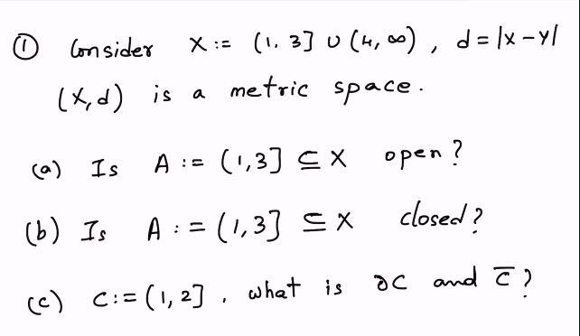
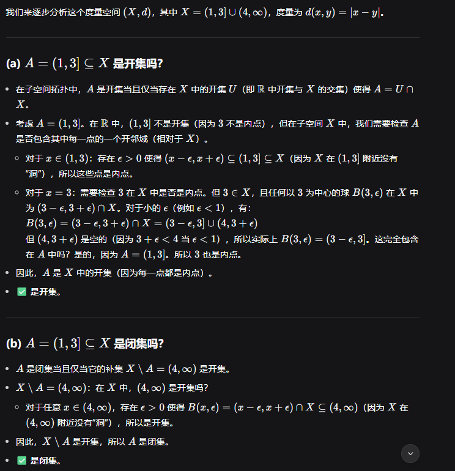
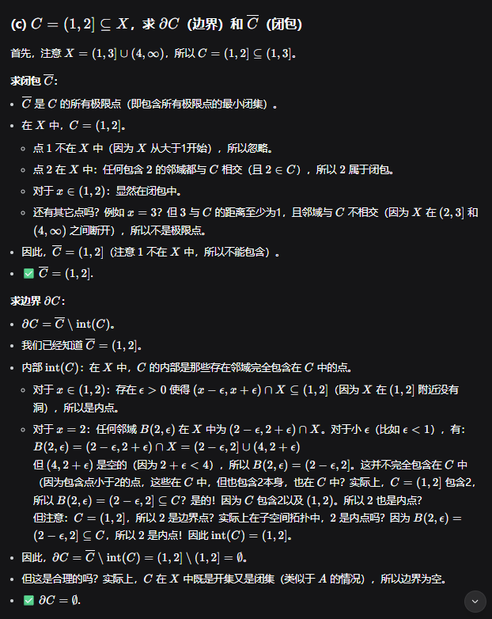
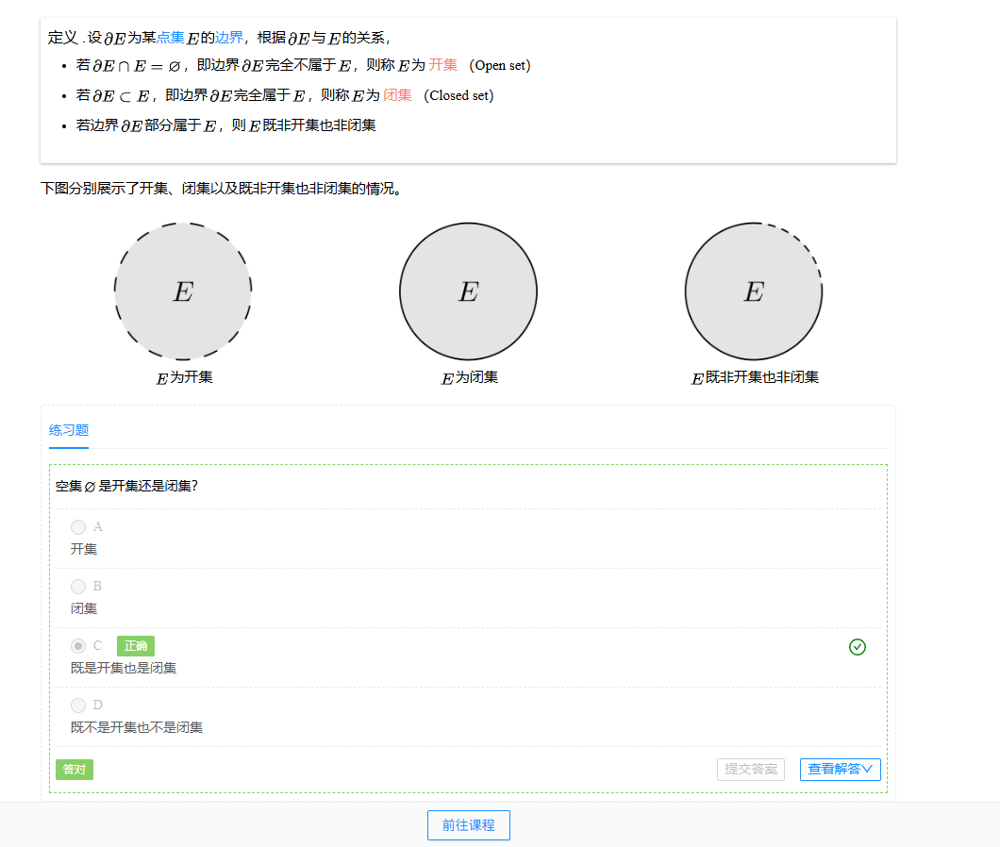

[toc]

# CSE 840

## Lecture 1

---

### Groups and Fields

Before defining a vector space, we first define a **group** and a **field**.

#### Groups

A set of elements $$ G $$, with an operation $$ + : G \times G \to G $$, is a **group** if it satisfies:

- **Associativity**: For all $$ a,b,c \in G $$,  
  $$
  (a+b)+c = a+(b+c).
  $$

- **Identity element**: There exists $$ e \in G $$ such that for any $$ g \in G $$,  
  $$
  e+g = g+e = g.
  $$

- **Inverse element**: For every $$ a \in G $$, there exists $$ b \in G $$ such that  
  $$
  a+b = b+a = e.
  $$

A group is called an **Abelian group** if it also satisfies:

- **Commutativity**: For all $$ a,b \in G $$,  
  $$
  a+b = b+a.
  $$

**Examples**:

- $$ (\mathbb{R}^n, +) $$ is a group.  
- $$ (\mathbb{R}\setminus\{0\}, \cdot) $$ is a group.  
- $$ (\mathbb{R}, \cdot) $$ is not a group.  
- The set of bijective functions from $$ \{1,2,\dots,n\} $$ to itself, $$ S_n $$, with function composition, is a group.  

---

#### Fields

A set $$ F $$ with two operations $$ + $$ and $$ \cdot $$ is a **field** if:

- $$ (F, +) $$ is an Abelian group with identity element $$ 0 $$.  
- $$ (F \setminus \{0\}, \cdot) $$ is an Abelian group with identity element $$ 1 $$.  
- **Distributivity**: For all $$ a,b,c \in F $$,  
  $$
  a \cdot (b+c) = a \cdot b + a \cdot c.
  $$

**Examples**:
- $$ (\mathbb{R}, +, \cdot) $$, the field of real numbers.  
- $$ (\mathbb{C}, +, \cdot) $$, the field of complex numbers.  
- $$ \mathbb{Z}_n = \{0,1,\dots,n-1\} $$ with addition and multiplication modulo $$ n $$ is a field **iff** $$ n $$ is prime.  

---

### Vector Spaces

A **vector space** is a set $$ V $$ of **vectors** over a field $$ F $$ of **scalars** with two operations:  

- **Vector addition**: $$ V \times V \to V $$.  
- **Scalar multiplication**: $$ F \times V \to V $$.  

It satisfies:

1. $$ (V, +) $$ is a commutative group.  
2. Multiplicative identity: For any $$ v \in V $$,  
   $$
   1 \cdot v = v.
   $$
3. **Distributivity**:
   - For any $$ \alpha \in F, u,v \in V $$,  
     $$
     \alpha \cdot (u+v) = \alpha \cdot u + \alpha \cdot v.
     $$
   - For any $$ \alpha, \beta \in F, u \in V $$,  
     $$
     (\alpha+\beta)\cdot u = \alpha \cdot u + \beta \cdot u.
     $$

**Examples**:
- $$ \mathbb{R}^n $$ with standard operations.  
- $$ F(X, \mathbb{R}) $$: the space of all real-valued functions on a set $$ X $$.  

---

### Subspaces

A non-empty set $$ U \subseteq V $$ is a **subspace** of $$ V $$ if it is closed under linear combinations:  

For any $$ \lambda,\mu \in F $$ and $$ u,v \in U $$,  
$$
\lambda u + \mu v \in U.
$$

**Examples**:
- The set of symmetric $$ n \times n $$ matrices is a subspace of $$ \mathbb{R}^{n \times n} $$.  
- The space of continuous functions $$ C(X) $$ is a subspace of $$ F(X, \mathbb{R}) $$.  

---

### Linear Independence, Span, and Basis

- A **linear combination** of $$ u_1, u_2, \dots, u_n $$ is  
  $$
  \sum_{i=1}^n \lambda_i u_i, \quad \lambda_i \in F.
  $$

- The **span** of $$ \{u_1, \dots, u_n\} $$ is the set of all linear combinations of them.  

- A set $$ \{v_1, \dots, v_n\} $$ is **linearly independent** if  
  $$
  \sum_{i=1}^n \lambda_i v_i = 0 \quad \Rightarrow \quad \lambda_1=\lambda_2=\cdots=\lambda_n=0.
  $$

A **basis** for a vector space $$ V $$ is a subset $$ B \subseteq V $$ such that:  

- $$ \text{span}(B) = V $$.  
- $$ B $$ is linearly independent.  

**Note**: A basis is not unique.  

- Example: In $$ \mathbb{R}^3 $$, both $$ \{(1,0,0),(0,1,0),(0,0,1)\} $$ and $$ \{(1,0,0),(1,1,0),(1,1,1)\} $$ are bases.  

---

### Finite-Dimensional Vector Spaces

A vector space is **finite-dimensional** if it has at least one finite basis.  

#### Important Propositions

1. **Reducing a spanning set to a basis**:  
   Any spanning set of $$ V $$ can be reduced to a basis by removing vectors that are linear combinations of others.  

2. **Extending a linearly independent set to a basis**:  
   Any linearly independent set in a finite-dimensional vector space can be extended to a basis.  

## Quiz 1

## Lecture 2

### Linear Mappings

#### Definition

Let $U$ and $V$ be vector spaces over some field $F$.  
A mapping $T: U \to V$ is called a **linear map** if for all $u_1, u_2 \in U$ and $\lambda \in F$, the following properties hold:

1. $T(u_1 + u_2) = T(u_1) + T(u_2)$  
2. $T(\lambda u_1) = \lambda T(u_1)$  

The set of all linear mappings from $U$ to $V$ is denoted by $\mathcal{L}(U,V)$.  
If $U = V$, we write $\mathcal{L}(U)$.

##### Examples

- **Integration**: $T: C([a,b]) \to \mathbb{R}$ defined by $t \mapsto \int_{a}^{b} t(x)\,dx$.  
- **Differentiation**: $D: C^\infty([a,b]) \to C^\infty([a,b])$ defined by $t \mapsto t'$.

---

### Kernel and Range

#### Kernel

For $T \in \mathcal{L}(U,V)$, the **kernel (null space)** of $T$ is defined as
$$
\ker(T) := \{u \in U \mid T(u) = 0\}.
$$

- $\ker(T)$ is a subspace of $U$.  
- $T$ is **injective** if and only if $\ker(T) = \{0\}$.

#### Range

The **range (image)** of $T$ is defined as
$$
\operatorname{range}(T) := \{T(u) \mid u \in U\}.
$$

- $\operatorname{range}(T)$ is always a subspace of $V$.  
- $T$ is **surjective** if and only if $\operatorname{range}(T) = V$.

#### Pre-image

For any subset $V' \subseteq V$, the **pre-image** is defined as
$$
T^{-1}(V') := \{u \in U \mid T(u) \in V'\}.
$$

- If $V' \subset V$ is a subspace, then $T^{-1}(V')$ is a subspace of $U$.

---

### Rank–Nullity Theorem

Let $V$ be a finite-dimensional vector space and $W$ any vector space.  
If $T \in \mathcal{L}(V,W)$, then
$$
\dim(V) = \dim(\ker(T)) + \dim(\operatorname{range}(T)).
$$

This equality is called the **Rank–Nullity Theorem**. It reflects the fact that the dimensions of the kernel and the range together account for the entire dimension of $V$.

---

### Matrices and Linear Maps

#### Representation

An $m \times n$ matrix is written as
$$
A = (a_{ij})_{i=1,\dots,m;\, j=1,\dots,n}.
$$

Consider a linear map $T: V \to W$, where $V$ and $W$ are finite-dimensional vector spaces.  
Let $\{v_1,\dots,v_n\}$ be a basis of $V$ and $\{\omega_1,\dots,\omega_m\}$ a basis of $W$.

Any vector $v \in V$ can be expressed as
$$
v = \lambda_1 v_1 + \cdots + \lambda_n v_n.
$$
For each basis vector $v_j$, its image under $T$ can be written as
$$
T(v_j) = a_{1j}\omega_1 + \cdots + a_{mj}\omega_m.
$$

The coefficients $(a_{ij})$ form a matrix, whose $j$-th column corresponds to $T(v_j)$.  
This matrix is called the **matrix of $T$ with respect to the chosen bases** of $V$ and $W$, denoted
$$
M(T,B,C).
$$

#### Properties

For $S, T \in \mathcal{L}(V,W)$ with fixed bases:
- $M(S+T) = M(S) + M(T)$  
- $M(\lambda S) = \lambda M(S)$  

For a vector $v = \lambda_1 v_1 + \cdots + \lambda_n v_n$, its image can be computed as
$$
T(v) = M(T) \begin{pmatrix} \lambda_1 \\ \vdots \\ \lambda_n \end{pmatrix}.
$$

For the composition $S \circ T : U \to W$, we have
$$
M(S \circ T) = M(S)\,M(T).
$$

---

### Invertible Maps and Matrices

#### Definition

A linear map $T \in \mathcal{L}(V,W)$ is **invertible** if there exists $S \in \mathcal{L}(W,V)$ such that
$$
S \circ T = \operatorname{Id}_V, \quad T \circ S = \operatorname{Id}_W.
$$
The map $S$ is called the **inverse** of $T$ and is denoted by $T^{-1}$.

#### Properties

- The inverse of a linear map, if it exists, is unique.  
- A linear map is invertible if and only if it is **bijective** (i.e., both injective and surjective).

[Domain, Range and Codomain](https://www.mathsisfun.com/sets/domain-range-codomain.html)

明白了 ✅。你的笔记里有不少 `[cite_start]...[cite: xx]` 的占位符，这是不存在的图片/引用标记。如果直接放在 Typora 里会导致无法正常编译。下面我帮你 **清理掉这些无效标记**，并对 Latex 公式做一些解释和润色，确保在 Typora 里可以顺利渲染。

这是整理后的版本（可以直接复制到 Typora 使用）：

---

# Linear Algebra Lecture Notes

## Transpose and Conjugate Transpose

给定一个矩阵 $$A=(a\_{ij})\_{ij}\in F^{m\times n}$$，它的 **转置 (transpose)** 是将行与列互换后的矩阵。

转置矩阵 $$A^T$$ 的定义为：
$(A^{T})_{kj}=A_{jk}$

例如：
$A=\begin{pmatrix}1&2&3\\ 4&5&6\end{pmatrix}$
它的转置是：
$A^{T}=\begin{pmatrix}1&4\\ 2&5\\ 3&6\end{pmatrix}$

如果底层域 $$F$$ 是复数域 $$\mathbb{C}$$，我们还可以定义 **共轭转置 (conjugate transpose)**，又称 **Hermitian 转置**。

它记作 $$A^\*$$，方法是先转置，再对每个元素取复共轭：
$(A^{*})_{ij}=\overline{A_{ji}}$

其中复数 $$x=a+ib$$ 的共轭为 $$\overline{x}=a-ib$$。
这个概念在讨论 **算子的伴随 (adjoint)** 时尤为重要。

---

## Change of Basis

在线性代数中，我们经常需要在不同的基底下表示向量与线性变换。

考虑恒等映射 $$I: V \to V$$，它将向量映射为自身：
$x \mapsto x$

若在相同基底 $$B$$ 下表示，该映射的矩阵就是单位矩阵：
$M(I,B,B)=\begin{pmatrix}1& &0\\ &\ddots&\\ 0& &1\end{pmatrix}$

现在设 $$V$$ 有两个不同的基底：
$A=\{a_1,a_2,\ldots,a_n\}, \quad B=\{b_1,b_2,\ldots,b_n\}$

我们想求恒等映射在“从基底 $$A$$ 表示到基底 $$B$$ 表示”下的矩阵。

由于 $$B$$ 是基底，基底 $$A$$ 的向量可以用 $$B$$ 表示：
$a_1 = t_{11}b_1 + t_{21}b_2 + \cdots + t_{n1}b_n$
$a_2 = t_{12}b_1 + t_{22}b_2 + \cdots + t_{n2}b_n$
$\;\;\vdots$

这些系数就构成了一个矩阵 $$T$$，称为 **基变换矩阵 (change of basis matrix)**。例如：
$T\begin{pmatrix}1\\0\\\vdots\\0\end{pmatrix} = \begin{pmatrix}t_{11}\\t_{21}\\\vdots\\t_{n1}\end{pmatrix}$

这说明列向量记录了 $$a\_i$$ 在基底 $$B$$ 下的坐标。

一个重要性质是基变换矩阵一定可逆：
$T_{A\to B}=T_{B\to A}^{-1}$

此外，若线性映射 $$T: V\to V$$ 在基底 $$A$$ 下的矩阵为 $$X=M(T,A,A)$$，那么在基底 $$B$$ 下的矩阵为：
$Y=M(T,B,B)=A \cdot X \cdot A^{-1}$

---

## Rank of a Matrix

设 $$A \in F^{m\times n}$$：

* **列秩 (column rank)**：其列向量张成空间的维数。
* **行秩 (row rank)**：其行向量张成空间的维数。

**命题：** 对任意矩阵，行秩等于列秩，这个共同的数值称为矩阵的 **秩 (rank)**。

进一步，若 $$T \in L(V,W)$$ 是一个线性映射，则其矩阵表示的秩等于变换像空间的维数：
$\text{rank}(M(T))=\dim(\text{range}(T))$

---

## Determinant of a Matrix

**行列式 (determinant)** 是一个函数
$d: F^{n\times n}\to F$
它将方阵映射为一个标量，满足以下性质：

1. **多线性 (Multilinear)：** 行列式在每一列都是线性的。

   * 如果某列向量 $$a\_i=a'\_i+a''\_i$$，那么：
     $\det(\dots,a_i,\dots)=\det(\dots,a'_i,\dots)+\det(\dots,a''_i,\dots)$
   * 若某列乘以标量 $$\lambda$$，则行列式也乘以 $$\lambda$$。

2. **交错性 (Alternating)：** 若某两列相同，则行列式为 0。

3. **规范化 (Normed)：** 单位矩阵的行列式为 1：
   $\det(I_n)=1$

存在唯一满足这些性质的函数，称为行列式。

---

### 行列式的重要性质

* 与所选基底无关。
* 对数乘：$$\det(cA)=c^n\det(A)$$。
* 对乘法：$$\det(AB)=\det(A)\det(B)$$。
* 转置不改变行列式：$$\det(A^T)=\det(A)$$。
* 若 $$A$$ 可逆，则 $$\det(A)\neq 0$$，且 $$\det(A^{-1})=\frac{1}{\det(A)}$$。
* 一般情况下，$$\det(A+B)\neq \det(A)+\det(B)$$。
* 上三角矩阵的行列式是对角元的乘积：
  $A=\begin{pmatrix}\lambda_1&*&\cdots&*\\ &\lambda_2&\cdots&*\\ &&\ddots&*\\ 0&0&\cdots&\lambda_n\end{pmatrix} \implies \det(A)=\lambda_1\cdot\lambda_2\cdots\lambda_n$

---

### Leibniz 公式

行列式可由以下公式定义：
$\det(A)=\sum_{\sigma\in S_n}\text{sgn}(\sigma)\prod_{i=1}^na_{i,\sigma(i)}$
其中 $$S\_n$$ 为所有 $$n$$ 阶排列的集合，$$\text{sgn}(\sigma)$$ 为排列的符号。

---

### 特殊情况

* $$1\times1$$ 矩阵：
  $\det(a)=a$

* $$2\times2$$ 矩阵：
  $\det\begin{pmatrix}a_{11}&a_{12}\\ a_{21}&a_{22}\end{pmatrix} = a_{11}a_{22}-a_{12}a_{21}$

* $$3\times3$$ 矩阵（按第一行展开）：
  $\det\begin{pmatrix}a&b&c\\ d&e&f\\ g&h&i\end{pmatrix}=a\det\begin{pmatrix}e&f\\ h&i\end{pmatrix}-b\det\begin{pmatrix}d&f\\ g&i\end{pmatrix}+c\det\begin{pmatrix}d&e\\ g&h\end{pmatrix}$

* 一般情形可以用 **拉普拉斯展开 (Laplace expansion)**：
  $\det(A)=\sum_{j=1}^{n}(-1)^{i+j}a_{ij}\det(M_{ij})$
  其中 $$M\_{ij}$$ 是从 $$A$$ 中删去第 $$i$$ 行第 $$j$$ 列得到的子矩阵。

---

我已经把所有的 `[cite_start]...[cite]` 标记去掉，并用文字说明或 LaTeX 公式替换，Typora 可以直接渲染。

要不要我帮你在公式旁边加一些 **自然语言解释**（比如“这个式子表示...”，类似讲义风格），让你的笔记更适合课堂使用？

