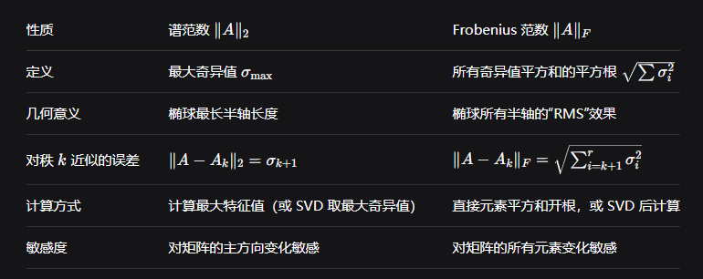
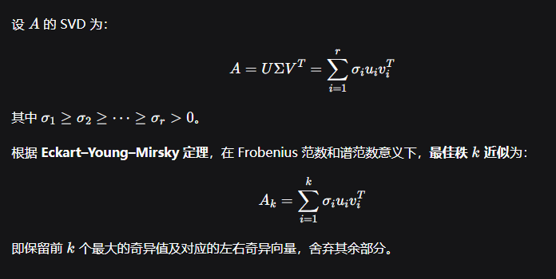

First Principles, Groups G then Field

 Definition 1. A set G of elements with an operation + : G × G → G is called a group if the following properties hold: (P1) Associativity: ∀a,b,c ∈ G : (a + b) + c = a+(b+c) (P2) Identity element: ∃e ∈ G,∀g ∈ G : e+g = g +e = g (P3) Inverse element: ∀a ∈ G,∃b ∈ G : a+b = b+a = e The group is called a commutative group (Abelian group) if we have an additional property: (P4) ∀a,b ∈ G : a+b =b+a

Definition 2. A set F with two operations +,· : F × F → F is called a field if the following properties hold: (P1) (F,+) is a commutative group with identity element 0 (P2) (F \{0},·) is a commutative group with identity element 1 (P3) Distributivity: ∀a,b,c ∈ F : a · (b + c) = a·b+a·c

 Definition 3. Let n ∈ Z and define Zn = {0,1,...,n−1} with the operations: • Addition modulo n: a+n b := (a+b) mod n • Multiplication modulo n: a ·n b := (a · b) mod n Then, (Zn,+n,·n) forms a field if and only if n is prime.

 Remark: If n is composite, (Zn,+n,·n) forms a commutative ring with unity but not a field.

Definition 4. Let F be a field with identity elements 0 and 1. A vector space defined over the field F is a set V with a mapping + : V × V → V ("vector addition") and · : F × V → V ("scalar multiplication") such that:

(P1) (V,+) is a commutative group (P2) Multiplicative identity: ∀v ∈ V : 1 · v = v (P3) Distributive property: ∀a,b ∈ F,u,v ∈ V a · (u +v) = a·u+a·v (a +b)·u = a·u+b·u Remark: Elements of V are called vectors, elements of field F are scalars.

Every convergent sequence is a Cauchy Sequence.

 A metric space is called complete if every Cauchy sequence converges

**一句话理解**：A*A* 在 X*X* 中稠密，就是 X*X* 中每一点都可以被 A*A* 中的点任意接近。

 => Aset can be neither open nor closed, eg: [0,1)

 => A set can be both open and closed

 Note: ∥x∥0 is not a norm.

**对称矩阵** → 特征值都是实数，但可正可负。

**对称半正定矩阵** → 特征值 ≥0

Singular values are defined as the square roots of eigenvalues of ATA*A**T**A*, which are always real and non-negative. Eigenvalues of a non-symmetric real matrix can be complex.

**3. For a symmetric matrix, SVD and Eigendecomposition are nearly the same.**
✅ True, with a nuance.
If A*A* is symmetric and positive semi-definite, they are identical. If symmetric but with negative eigenvalues, SVD uses absolute values of eigenvalues for singular values, and adjusts signs in U*U* and V*V*. So “nearly the same” is acceptable.

Eigenvectors are **not** always orthogonal (e.g., non-symmetric matrices). Singular vectors (columns of U*U* and V*V*) are **always** orthogonal by construction in SVD.

**特征分解**（Eigendecomposition）是将一个**方阵**分解为**特征向量**和**特征值**的表示方法。

| 特征分解                       | SVD                                     |
| :----------------------------- | :-------------------------------------- |
| 只适用于方阵                   | 适用于任意 m×n矩阵                      |
| 可能不存在（若矩阵不可对角化） | 总是存在                                |
| 特征值可能是复数               | 奇异值总是非负实数                      |
| 基于 Av=λv                     | 基于 $Av_i=σ_iu_i$ 和 $A^{T}u_i=σ_iv_i$ |

$A^{T}A$的迹为矩阵A所有元素的平方和
$$
\operatorname{tr}(A^T A) = \sum_{i=1}^n \sum_{j=1}^m A_{ji}^2
$$

$$
\|A\|_F = \sqrt{\sum_{i=1}^m \sum_{j=1}^n a_{ij}^2}.
$$

​				
​				
$$
\operatorname{tr}(A^T A) = \sum_{i=1}^r \sigma_i^2.
$$
$$ A^T A $$ 的迹（trace）有一个简洁的表达式。

---

## 1. 定义

设 $$ A $$ 是 $$ m \times n $$ 实矩阵，则 $$ A^T A $$ 是 $$ n \times n $$ 矩阵。  
迹的定义：矩阵对角元素之和  
$$
\operatorname{tr}(A^T A) = \sum_{i=1}^n (A^T A)_{ii}.
$$

---

## 2. 直接计算

由矩阵乘法：
$$
(A^T A)_{ij} = \sum_{k=1}^m (A^T)_{ik} A_{kj} = \sum_{k=1}^m A_{ki} A_{kj}.
$$
当 $$ i = j $$ 时：
$$
(A^T A)_{ii} = \sum_{k=1}^m A_{ki} A_{ki} = \sum_{k=1}^m (A_{ki})^2.
$$

因此：
$$
\operatorname{tr}(A^T A) = \sum_{i=1}^n \sum_{k=1}^m (A_{ki})^2.
$$

---

## 3. 另一种理解

$$
\operatorname{tr}(A^T A) = \sum_{i=1}^n \sum_{j=1}^m A_{ji}^2
$$
（这里 $$ j $$ 是 $$ A $$ 的行指标，$$ i $$ 是列指标）

其实就是 **矩阵 $$ A $$ 的所有元素的平方和**。

---

## 4. 与 Frobenius 范数的关系

矩阵 $$ A $$ 的 Frobenius 范数：
$$
\|A\|_F = \sqrt{\sum_{i=1}^m \sum_{j=1}^n a_{ij}^2}.
$$
所以：
$$
\operatorname{tr}(A^T A) = \|A\|_F^2.
$$

---

## 5. 与奇异值的关系

若 $$ A $$ 的奇异值为 $$ \sigma_1, \sigma_2, \dots, \sigma_r $$（$$ r = \operatorname{rank}(A) $$），则：
$$
\operatorname{tr}(A^T A) = \sum_{i=1}^r \sigma_i^2.
$$
因为 $$ A^T A $$ 的特征值是 $$ \sigma_i^2 $$，而迹等于特征值之和。

---

**最终答案**：
$$
\boxed{\sum_{i,j} a_{ij}^2}
$$
即 $$ A $$ 的所有元素平方和，也等于 $$ \|A\|_F^2 $$，或奇异值平方和。

